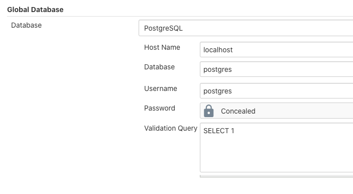

# Junit SQL Storage Plugin

[](https://ci.jenkins.io/job/Plugins/job/junit-sql-storage-plugin/job/master/)
[](https://github.com/jenkinsci/junit-sql-storage-plugin/graphs/contributors)
[](https://plugins.jenkins.io/junit-sql-storage)
[](https://github.com/jenkinsci/junit-sql-storage-plugin/releases/latest)
[](https://plugins.jenkins.io/junit-sql-storage)

## Introduction

Implements the pluggable storage API for the [Junit plugin](https://plugins.jenkins.io/junit/).

In common CI/CD use-cases a lot of the space is consumed by test reports. 
This data is stored within JENKINS_HOME, and the current storage format requires huge overheads when retrieving statistics and, especially trends. 
In order to display trends, each report has to be loaded and then processed in-memory.

The main purpose of externalising Test Results is to optimize Jenkins logic by querying the desired data from specialized external storage.

This plugin adds a SQL extension, any database should work although we're only currently testing against PostgreSQL.

Tables will be automatically created.

## Getting started

Install your database vendor specific plugin, you can use the Jenkins plugin manager to search for it:

`${JENKINS_URL}/pluginManager/available?filter=Database`

e.g. you could install the [PostgreSQL Database](https://plugins.jenkins.io/database-postgresql/) plugin.

### UI

Manage Jenkins => Configure System => Junit

In the dropdown select 'SQL Database'


Manage Jenkins => Configure System => Global Database

Select the database implementation you want to use and click 'Test Connection' to verify Jenkins can connect



Click 'Save'

### Configuration as code

```yaml
unclassified:
  globalDatabaseConfiguration:
    database:
      postgreSQL:
        database: "jenkins"
        hostname: "${DB_HOST_NAME}"
        password: "${DB_PASSWORD}"
        username: "${DB_USERNAME}"
        validationQuery: "SELECT 1"
  junitTestResultStorage:
    storage: "database"
```

## Contributing

Refer to our [contribution guidelines](https://github.com/jenkinsci/.github/blob/master/CONTRIBUTING.md)

## LICENSE

Licensed under MIT, see [LICENSE](LICENSE.md)

